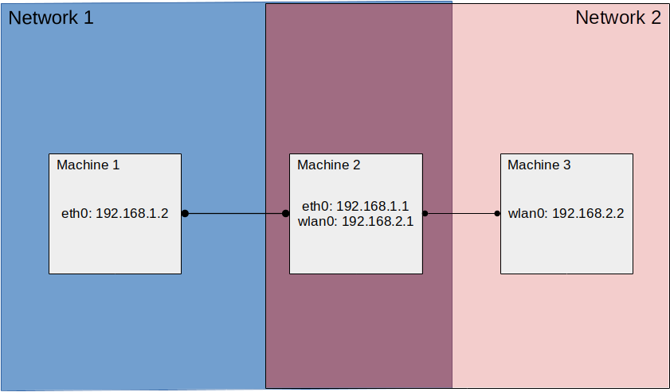

# Routing

A common issue in robotics is handling communication across different network subnets. This is pariticularly relevant for frameworks such as ROS which are highly bound to a particular network domain.

To solve this, and allow for message passing between different subnets, we can make use of IP tables and network routing.

## Setup

The image below provides an example of a common network topology, where two machines (Machines 1 and 3) exist on seperate networks but share an intermediary machine (Machine 3) that is on both networks. 

 

To allow for communucation between Machine 1 and 3, we must first add some iptables rules to Machine 2 to allow it to forward messages between networks 1 and 2.

```bash
# Allow traffic to be forwarded from eth0 to wlan0
iptables -A FORWARD -i eth0 -j ACCEPT
# Allow traffic to be forwarded from wlan0 to eth0
iptables -A FORWARD -i wlan0 -j ACCEPT


iptables -t nat -A POSTROUTING -o eth0 -j MASQUERADE
iptables -t nat -A POSTROUTING -o wlan0 -j MASQUERADE
```

Next, we must add a routing rule on Machine 1

```bash
sudo route add -net 192.168.2.0 netmask 255.255.255.0 gw 192.168.1.1 eth0
```

And on Machine 3

```bash
sudo route add -net 192.168.1.0 netmask 255.255.255.0 gw 192.168.2.1 wlan0
```

## Testing

We should now be able to ping Machine 1 from Machine 3

```bash
~$ ping 192.168.1.2
PING 192.168.1.2 (192.168.1.2) 56(84) bytes of data.
64 bytes from 192.168.1.2: icmp_seq=1 ttl=63 time=2.08 ms
64 bytes from 192.168.1.2: icmp_seq=2 ttl=63 time=2.20 ms
64 bytes from 192.168.1.2: icmp_seq=3 ttl=63 time=2.30 ms
```

And Machine 3 from Machine 1

```bash
~$ ping 192.168.2.2
PING 192.168.2.2 (192.168.2.2) 56(84) bytes of data.
64 bytes from 192.168.2.2: icmp_seq=1 ttl=63 time=3.00 ms
64 bytes from 192.168.2.2: icmp_seq=2 ttl=63 time=2.48 ms
64 bytes from 192.168.2.2: icmp_seq=3 ttl=63 time=3.04 ms
```

